# Design Tokens Package

## Table of Contents

- [Introduction](#introduction)
- [Getting Started](#getting-started)
- [Developing Design Tokens](#developing-design-tokens)
- [Interaction Overview](#interaction-overview)
- [Material UI Theme Integration](#material-ui-theme-integration)
- [Style Types Override](#style-types-override)
- [References](#references)

## Introduction

Design tokens are a way to store and manage visual design attributes (colors, typography, spacing, etc.) in a platform-agnostic and reusable format. They enable consistency and scalability in design systems by centralizing style values, making it easy to update and propagate changes across multiple platforms and products.

In this project, [style-dictionary](https://styledictionary.com/getting-started/installation/) is used to generate the design tokens. Design tokens are defined in a JSONC format in `src/theme/tokens.jsonc` and transformed into TypeScript and CSS files for use in your application. This file is meant to be be shared among developers and UX designers as the single source of truth.

## Getting Started

1. Install project dependencies with `npm i`.

2. Run the storybook to view the MUI components using design tokens with `npm run storybook`.

## Developing Design Tokens

1. Install project dependencies with `npm i`.

2. Build design tokens with the following command:

```sh
npm run build:tokens
```

This command executes:

```sh
ts-node src/theme/build-tokens.ts
```

This command will generate the following files:

- `tokens.ts`
- `tokens.d.ts`
- `tokens.css`

The outputs are controlled and determined in `style-dictionary.config.json`. Modify this accordingly for your own project requirements.

3. Build your application with:

```sh
npm run build
```

If you want to export the tokens for local development, run:

```sh
npm pack
```

This will generate a zipped file of your tokens (e.g. `design-tokens-1.0.0.tgz`) which you can use for local testing. Otherwise you can publish the package to a package repository:

```ts
import { tokens } from 'design-tokens/tokens';

const { palette, typography } = tokens;

const themeOptions: ThemeOptions = {
  palette: {
    primary: {
      main: palette.yellow['70'],
    },
    background: {
      default: palette.yellow['80'],
    },
  },
  typography: {
    fontWeightBold: typography.fontWeight,
    fontSize: parseFontSize(typography.fontSize),
    fontFamily: typography.fontFamily,
  },
  components: {
    MuiButton: {
      styleOverrides: {
        root: {
          fontWeight: typography.fontWeight,
          fontSize: parseFontSize(typography.fontSize),
          fontFamily: typography.fontFamily,
          color: palette.green['40'],
          backgroundColor: palette.green['20'],
        },
      },
    },
  },
};
```

## Interaction Overview

```mermaid
flowchart LR
  subgraph design-token package
    A[Designer/Developer updates tokens.jsonc] --> B[Run `npm run build:tokens`]
    B --> C[tokens.ts / tokens.css generated]
    C --> D[Run `npm run build` to generate latest dist folder]
    D --> E[Upgrade package version]
    E --> F[Publish latest package for other projects to import]
  end
  subgraph External Projects
    F --> G[Import updated design-token package]
    G --> H[Material UI ThemeOptions configured in codebase]
    H --> I[ThemeProvider applies theme to components]
    I --> J[Components use theme values for styling]
  end
```



## Material UI Theme Integration

Material UI components are customized using the generated design tokens via the `ThemeOptions` object in `src/theme/themeOptions.ts`. This integration ensures that your UI components consistently use the design system values defined by the designers.

Using `ThemeOptions` allows us to control the styles of your components globally, instead of having developers going into each component to manually override the styles of the component. This approach allows you to update your design tokens and have those changes automatically reflected throughout your Material UI components, ensuring a consistent and maintainable design system.

## Style Types Override

A new types file `mui-component-override.d.ts` is added into the build which other projects can import to extend the types of MUI components. For example, the "violet" color does not exist in `Button`, but you can declare it like this:

```ts
declare module '@mui/material/Button' {
  interface ButtonPropsColorOverrides {
    violet: true;
  }
}
```

In the other projects that are importing this `design-tokens` package, they will need to create a new types file (e.g. `mui-override.d.ts`) with the following import:

```ts
import 'design-tokens/mui-component-override';
```

## References

- [Material UI Theming](https://mui.com/material-ui/customization/theming/)
- [Style Dictionary](https://styledictionary.com/getting-started/installation/)
- [Awesome Design Tokens](https://github.com/sturobson/Awesome-Design-Tokens)
- [Module Augmentation](https://www.digitalocean.com/community/tutorials/typescript-module-augmentation)
